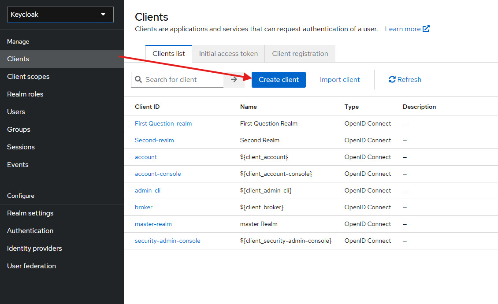
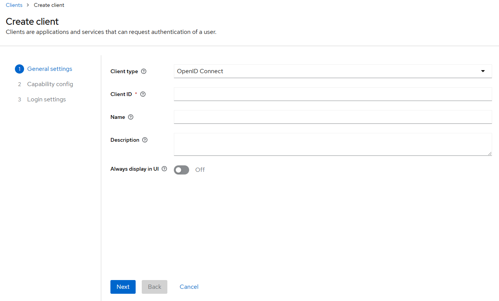
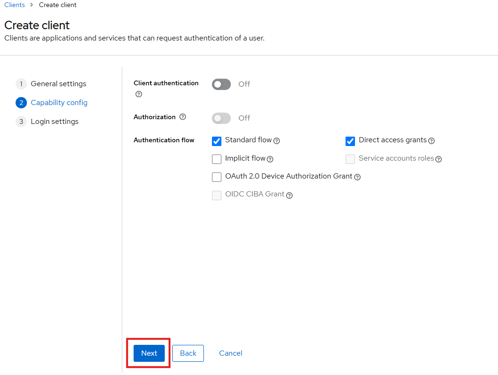
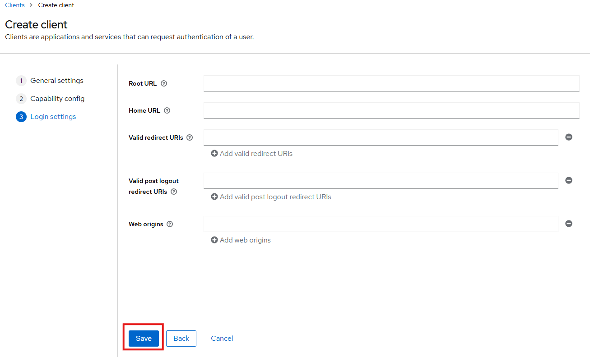

# Configuring a Clients

Clients are the way you can controll the authentications, through them you can mange the application you want to authenticate your user base, this whay you can use them even to auth applications, through the client-secrect configuration.

## Creating a Client

You can create one in the admin panel go to Clients option at the sidedrawer menu, by clicking them, you will se some of clients present by default in Keycloak, just click on the <strong>Create client</strong> button and fill the form will follow.

Let's explore the options...

- <strong>Client type:</strong> define the type of client's authentication you can select between OpenID Connect and SAML ways;

  > 

  > 
OpenID Connect

  > It is a protocol created by the OpenID Foundation and published at 2014, created on top of OAuth2 token system with authorization plus the Authentication process throug the idToken managed by Identity Provider
  > 

  > 

  > 
SAML

  > Sercurity Assertion Markup Language is a standard, XML-based, to make security assertions, passing user attributes or credential between LDP and the Service Provider, mainly used to SSO between organizations.
  > 

- <strong>Client ID:</strong> the name of your client used as identifies by the Identity Provider too;

- <strong>Name:</strong> your client's name, it is the name will appear in the login page;

- <strong>Description:</strong> as the name says, it is a description about the purpouse of the client.

At the next screen we will see some configurations to the client, they will define the behavior of the client and the authentication and authorizations they will lead with it.

For now, let's leave it the way it is and click on <strong>Next</strong>

The third screen, and the last one, we can configure the URL settings, such as redirect URL, mostly used with web app.

- <strong>Root URL:</strong> it is the URL base acting as a prefix for another paths you add in the another fields;
- <strong>Home URL:</strong> this one it used to redirect the users after the authentication or logout, if no other URL was provided;
- <strong>Valid redirect URL:</strong> some urls which keycloak can redirect user after login, this way you can set a callback and guide the user for a authenticated area, for instance. Can be a complete url `http://example.com`, or even a path patter, if you are using the <strong>Root URL</strong>, `/callback`;
- <strong>Valid post logout redirect URIs:</strong> on the other hand, of the previews option, says a valid logout path which keycloak can send the user after they effectively logout. 
- <strong>Web origins:</strong> this is how can you apply the [CORS](https://developer.mozilla.org/en-US/docs/Web/HTTP/CORS) configuration to paths who you will use. 

When everything is define, just press <strong>Save</strong>

## Examples
We can authenticate in our client in many ways, some of then is using the code auth, this flux is as follow:
1. User access the application
2. Application saw the auth user state, if not authenticated redirect the user to keycloak auth form
3. After credentials are placed, keycloak will redirect user to predefined callback url (Remember the <strong>Valid redirect URIs</strong>? Should be one of those)
4. This url (already out of Keycloak) will use the auth code to negotiate the authorization token (access token)
5. Then use will be abble to use the application.

