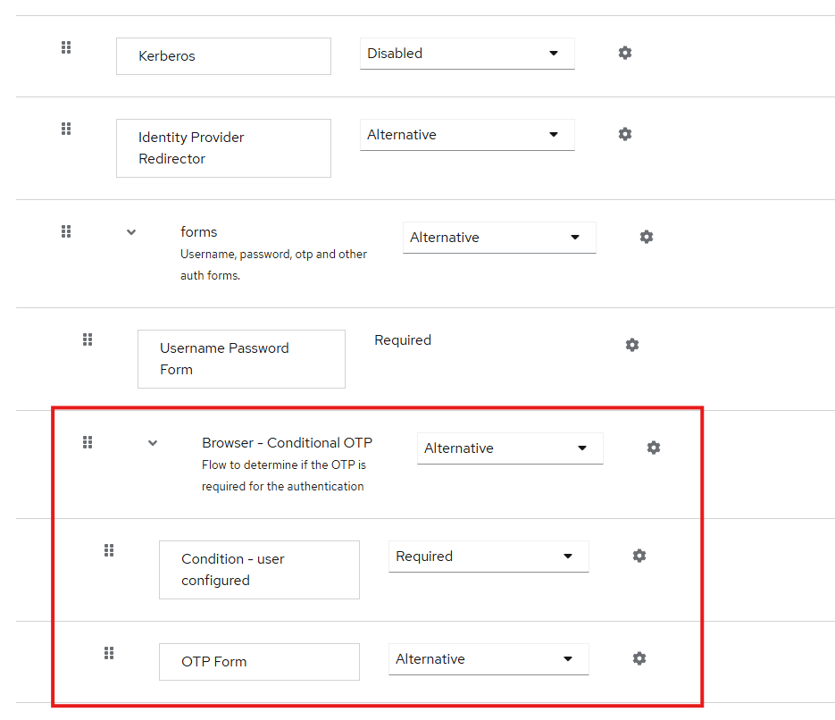
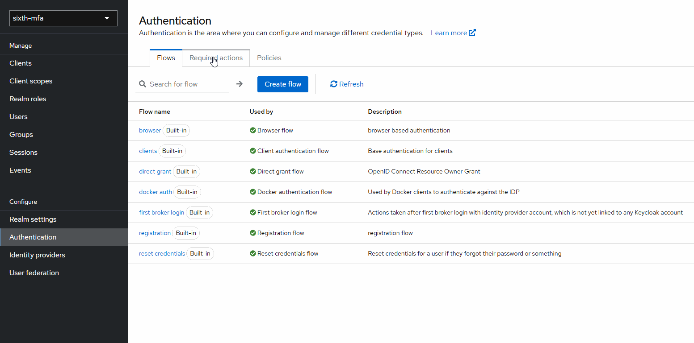
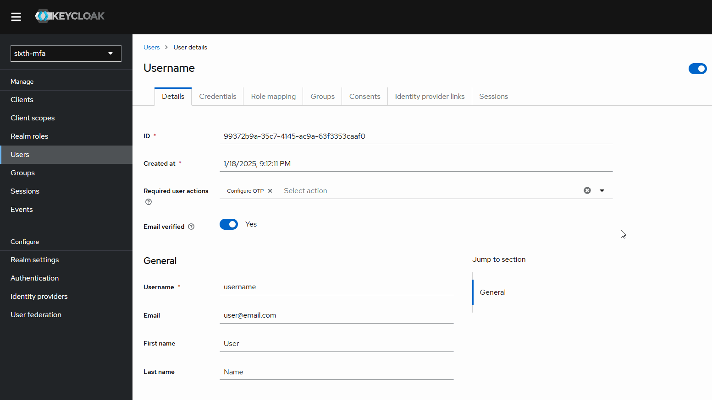
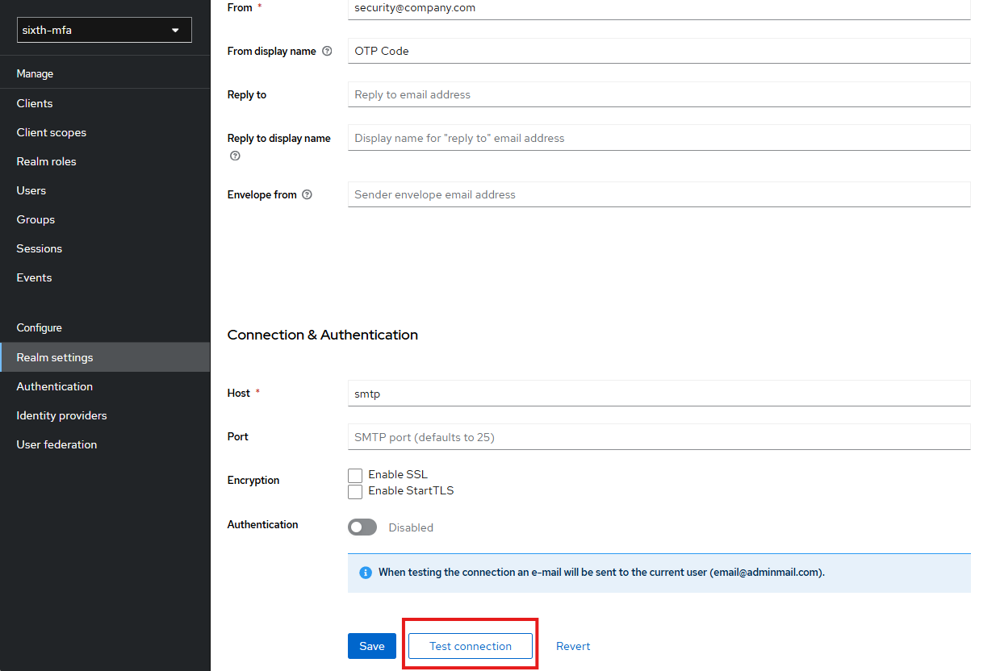
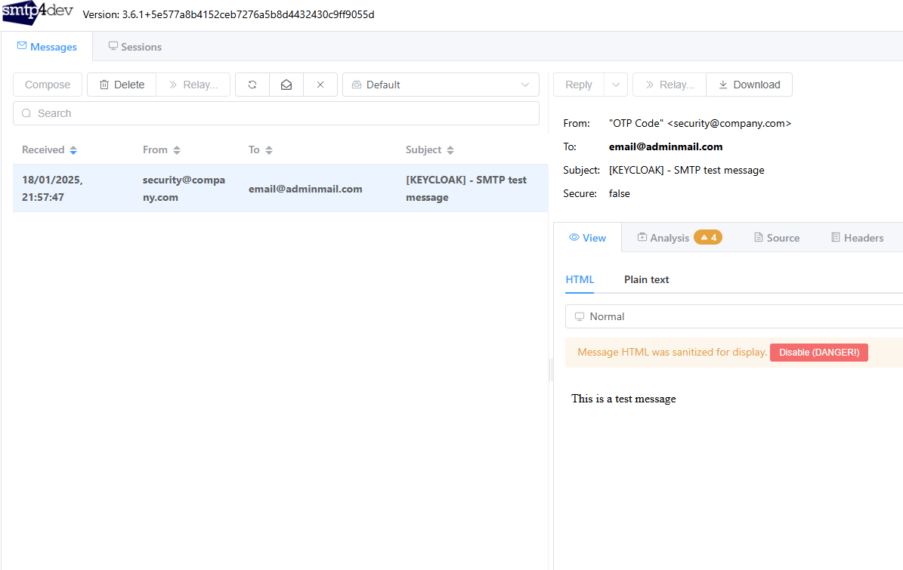
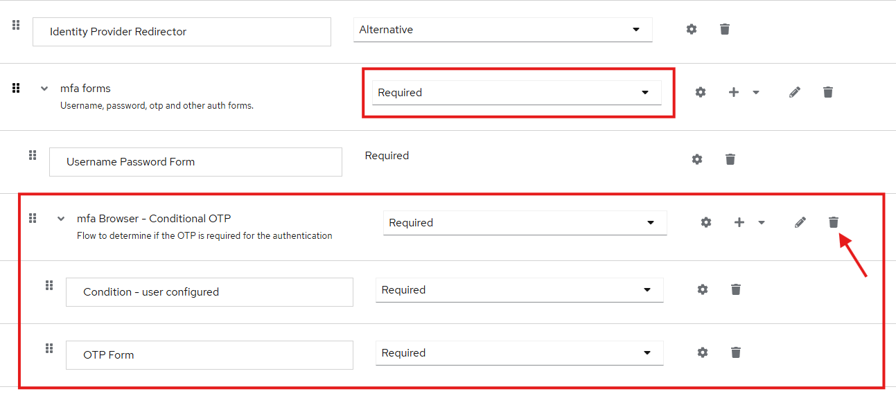
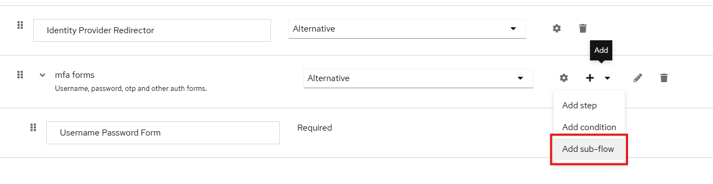

# Multi-factor Authentication (MFA)

As many other Identity Providers, Keycloak has the support for MFA and can use the Two FA apps as [Google Authenticator](https://play.google.com/store/apps/details?id=com.google.android.apps.authenticator2&hl=en) to generate an OTP to user, this way you will need configure de authentication flow through Admin Panel and Google Authentication or some app with [TOTP](https://www.twilio.com/docs/glossary/totp) support.

Is important to note the Keycloak it is not limited to, you can extende MFA possibilities with some providers such as [Email OTP](https://github.com/mesutpiskin/keycloak-2fa-email-authenticator) and [SMS OTP](https://github.com/netzbegruenung/keycloak-mfa-plugins/tree/main/sms-authenticator).

With this in mind let's configure the built-in MFA resource

## OTP Configuration

Let's create another real to make this configuration, after that go to <strong>Authentication</strong> area at <strong>Configure</strong> section, reaching this area you will see some Flows, here you can manage the way to user authentication or even create your own, for this one we do not need create one, if you enter in the browser flow you will see they already have this configuration, just change the <strong>Browser - Conditional OTP</strong> and <strong>OTP Form</strong> options to Required.


If you already have users in the Realm, you can activate the required configuration for them by adding the <strong>Required user action</strong> to configure OTP, and for new users from Realm you can go to <strong>Required actions</strong> tab and turn on the swith from <strong>Set as default action</strong> column, this way any new user will need to configure the OTP.
Whit this enabled by creating a new user they already will come with <strong>Configure OTP</strong> action required.


Just doing that the Keycloak interface will ask to user configure the OTP application, for test this lets create a client, called `otp-client`, and use the app from [clients](../clients/app/src/index.ts) folder to make a little test using the [Google Authenticator](https://play.google.com/store/apps/details?id=com.google.android.apps.authenticator2&hl=en) app.

We will start by creating a user and then login in followed by the OTP configuration.


## Email OTP Configuration

To configure email as OTP source, we need to change something in our development environment firs of all we need the 2FA Email Authenticator plugin you can clone the [repository](https://github.com/mesutpiskin/keycloak-2fa-email-authenticator) and follow the instructions to build or download the `.jar` from [here](https://github.com/shreyasY2k/keycloak-mfa/blob/main/plugins/keycloak-2fa-email-authenticator-1.0.0.0-SNAPSHOT.jar) with that put the `.jar` file in one folder, for this guide we already have in the [plugins](./plugins/) folder.

Now we need to add it to our developer keycloak, to do so just bind a volume from our plugins folder to providers folder inside the container, do tha by adding this:

```yaml
./mfa/plugins:/opt/keycloak/providers
```

to our [docker-compose.yaml](../docker-compose.yaml) file to send the email to user we need to configure a SMTP server to to this we will use the awesome tool [smtp4dev](https://github.com/rnwood/smtp4dev) who will simulate our email provider and be used to send the email with token, to do that add the following code to, again, our [docker-compose.yaml](../docker-compose.yaml)

```yaml
smtp:
  image: rnwood/smtp4dev:v3
  restart: always
  container_name: smtp4dev
  ports:
    - "8081:80"
    - "8025:25"
    - "8143:143"
```
> :bulb: Doing that you will have a "mailbox" by accessing http://localhost:8081

After that we need to configure the email options for the Realm, firs access the <strong>Realm settings</strong> in the side drawer menu and go to <strong>Email</strong> tab you can fill the form of template section the you want just the From item is required, means the email address user will see when receive the OTP, something like `security@company.com`.

What we need now is put the Smtp4Dev data in the <strong>Connection & Authentication</strong> section, as we running with docker compose in the sabe file we can use the service name as host and the container port of the container:
```txt
Host: smtp
Port: <leave it with default>
```
To test conection Keycloak ask for configure a email address to admin, you can put any email to him and test the connection.


To see the test email just access the http://localhost:8081, take a look at From and To options.


After this configured we can configure our OTP email, do to so, access the <strong>Authentication</strong> area just as before, to OTP configuration, and duplicate the `browser` flow, to make the things easier, to do that click on the three dots at the end of the line, gives a name (`mfa` for instance) and a description, if you want, then click on Duplicate button.

When the flow has opened you should see the same configuration previous saw at the `browser` but now we can edit. First of all change the `forms` option to requried and delete the flow right below the Username Password Form, it's name will be something like: `<FLO_NAME> Browser - Conditional OTP`.


After that click on `+` in mfa forms and add a new sub-flow

Give a name and click on Add button, when created change from `Disabled` to `Required` and add a Step by clicking on `+` and selec `Add step` option, at the opened modal use the search input and type email on it, you will see the `Email OTP` option there (Thanks for the plugin).

This is the configuration need it, now scroll to top of the screen click on the right top corner Action drow down, and select `Bind flow` option and bind it to `Browser flow`.

> :bulb: You can make the configuration required as we saw previously at APP OTP configuration.
> And make shure to define the plugin's theme to your Email option at the `Realm configuration > Themes`


Let's create a new user and see the flow in action

