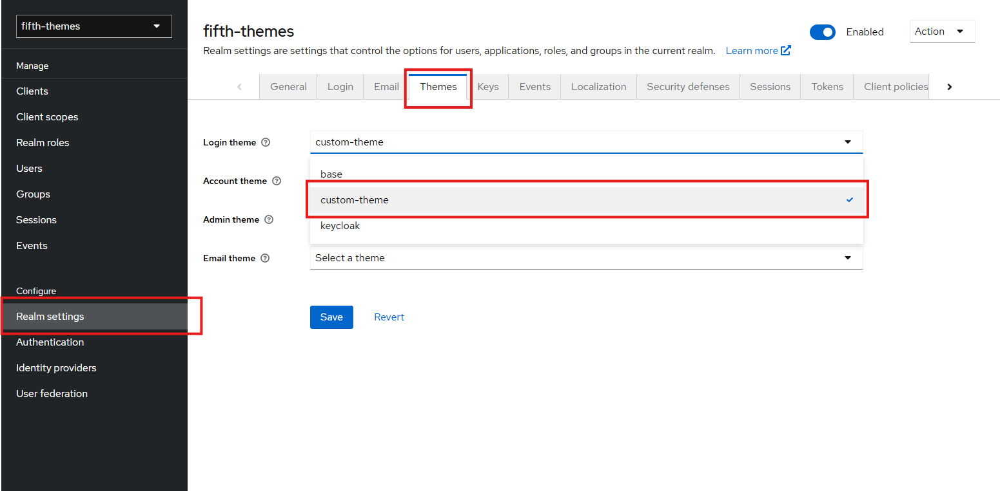
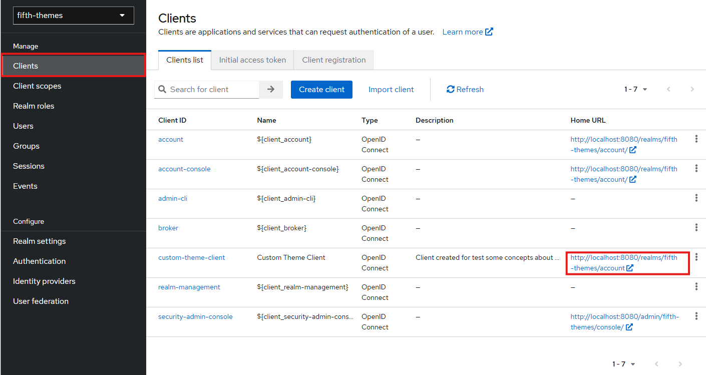

# Adding Themes

Focusing on a corporative way we can personalizade the screens and email from Keycloak though themes, that way you can create fancy screens and even apply the Design System from a company.

You can readmore about themes [here](https://www.keycloak.org/docs/latest/server_development/#_themes).

> :bulb: We can bind the theme directory from our contain in the one of our directory, this way we can edit and see the changes on our theme in runtime

For this guide we will create a custom login screen, but keep in mind you can change everything, the better whay to start it is simple copy a base template to start edit, to do not take risk of change and break something, thinking on that whe can follow the keycloak login page and make some specific changes, this way we can mantain some main features e add ours.

Keycloak cas a directory called `themes` at your root folder this way, to make things easy we will mapper our `templates` folter to them by creating a volume in our [docker-compose.yaml](../docker-compose.yaml) file, besides that we will add the `-Dkeycloak.theme.cacheThemes=false` to command section of the compose, this way the keycloak do not will mantain cache of themes and we can see ours changes just by refreshing the browser.

### Creating the theme

To starting let's create a `custom-theme` folder inside our `templates` directory, remember the name of the foltar is the name of the theme, after that we need create another folder based on what we want to change, for this example we will create a login theme, hence, let's create a directory called `login`.

Doing only that it not enought, we need a `theme.properties` file, it is here we will apply all configuration of our theme lets create one and put these as the firs 2 lines:

```txt
parent=base
import=common/keycloak
```

This way whe say to Keycloak to use the base theme as to extend some files and import resources from keycloak theme. To make thinkgs easier let's get a content base from Keycloak's github repository by accessing [this address](https://github.com/keycloak/keycloak/tree/archive/release/25.0/themes) for now lets pick the [`login.css`](https://github.com/keycloak/keycloak/blob/archive/release/25.0/themes/src/main/resources/theme/keycloak/login/resources/css/login.css) file and put it in the `/login/resources/css/`.

Now we need to create the corresponding file to screen we want to change, by creating the `login.ftl` file we start to implement ours login screen theme, let's do the same thing of css and get the [login.ftl](https://github.com/keycloak/keycloak/blob/archive/release/25.0/themes/src/main/resources/theme/base/login/login.ftl) base from repositoy, this time we will pick it from the base directory.

If we access the Admin panel our theme already in there, to see the them we can apply to a realm and see any login screen of it.
.

To change any aspect of the screen we need just see the correspondent class in the template and change it in the [login.css](./templates/custom-theme/login/resources/css/login.css) file, to change the background, for instance, change the class `.login-pf` adding the following code:

```css
.login-pf {
  background: linear-gradient(
        90deg,
        hsl(356 0% 97%) calc(20px - 2px),
        transparent 1%
      ) center, linear-gradient(
        hsl(356 0% 97%) calc(20px - 2px),
        transparent 1%
      ) center, hsl(207.69deg 73.03% 17.45%);
  background-size: 20px 20px;
  background-attachment: fixed;
}
```

This will apply a doted background in the entire page, in the same way add the following tin the `.login-pf body` class

```css
.login-pf body {
  height: 100%;
  background: linear-gradient(
    220deg,
    rgb(239 246 252) 50%,
    rgba(31, 101, 160, 0) 100%
  );
  margin: 0;
}
```

We just applied a background gradient over the dotted lines. If you already has applied the theme in the Realm you already can see the changes, go to clients and access the login from any of them.



We do not want the Realm name nor the "Sign in to your account" phrase, todo so create a file `message_<LANG>.properties` inside a `messages` folde, always inner the login theme folder.

Ex.: `messages/messages_en.properties`

After that add the following content:

```properties
loginTitle=Custom Theme Login
loginTitleHtml=
loginAccountTitle=
```

This will change the title of HTML page and remove the Real and and the "Sign in to your account" as we want, now we can put some logo to our screen, todo so, let's create a folder `img` inside resources foldes and add some logo to it, for this guide we will use the [datasette](https://datasette.io/) logo, to not get all `template.ftl` file with all they need to work, lets add the logo by CSS starting by creating a new classe in the [login.css](./templates/custom-theme/login/resources/css/login.css) file:

```css
.login_custom-logo {
  background-image: url(../img/datasette.svg);
  background-repeat: no-repeat;
  background-position: center;
  background-size: 30%;
}
```

We can change the the card of the form too, you can put the next css to apply it.

```css
.card-pf {
  margin-inline: auto;
  background: linear-gradient(
    220deg,
    rgb(239 246 252) 50%,
    rgba(31, 101, 160, 0) 100%
  );
  box-shadow: none;
  border-radius: 10px;
  padding: 0 20px;
  max-width: 500px;
}
```

After that add the following to [theme.properties](./templates/custom-theme/login/theme.properties) `kcHeaderWrapperClass=login_custom-logo` after that update the login screen in the browser and see the logo there.

## Summary
You can change change everything from the Admin screen to Email templates, to do so it is recommended copy the necessaries files from the base theme of the keycloak, this way you can see all the interactions and screens.

To see more about it you can access these materials:

1. [Keycloak Theme Docs](https://www.keycloak.org/docs/latest/server_development/#_themes)
2. [Apache FreeMarker](https://freemarker.apache.org/index.html)
3. [Repository](https://github.com/keycloak/keycloak/tree/archive/release/25.0/themes)
